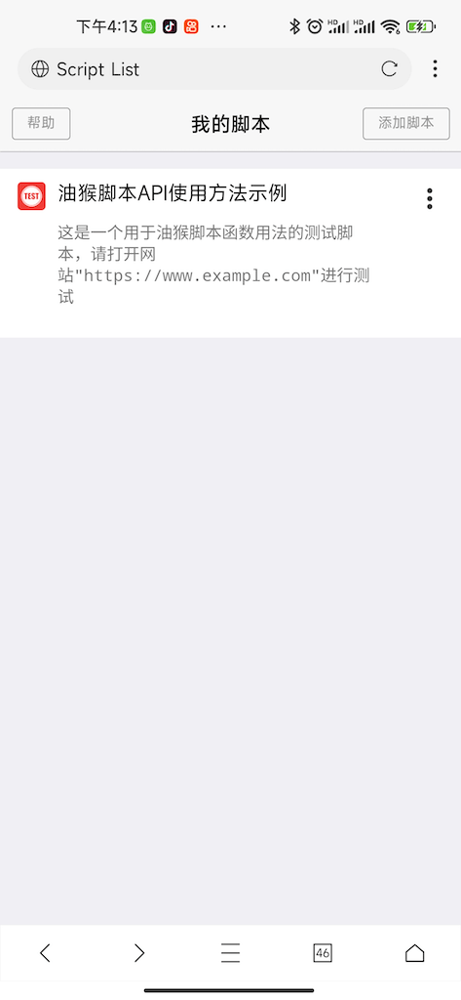
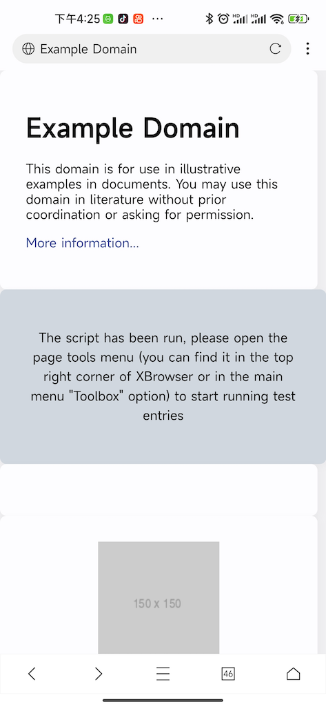
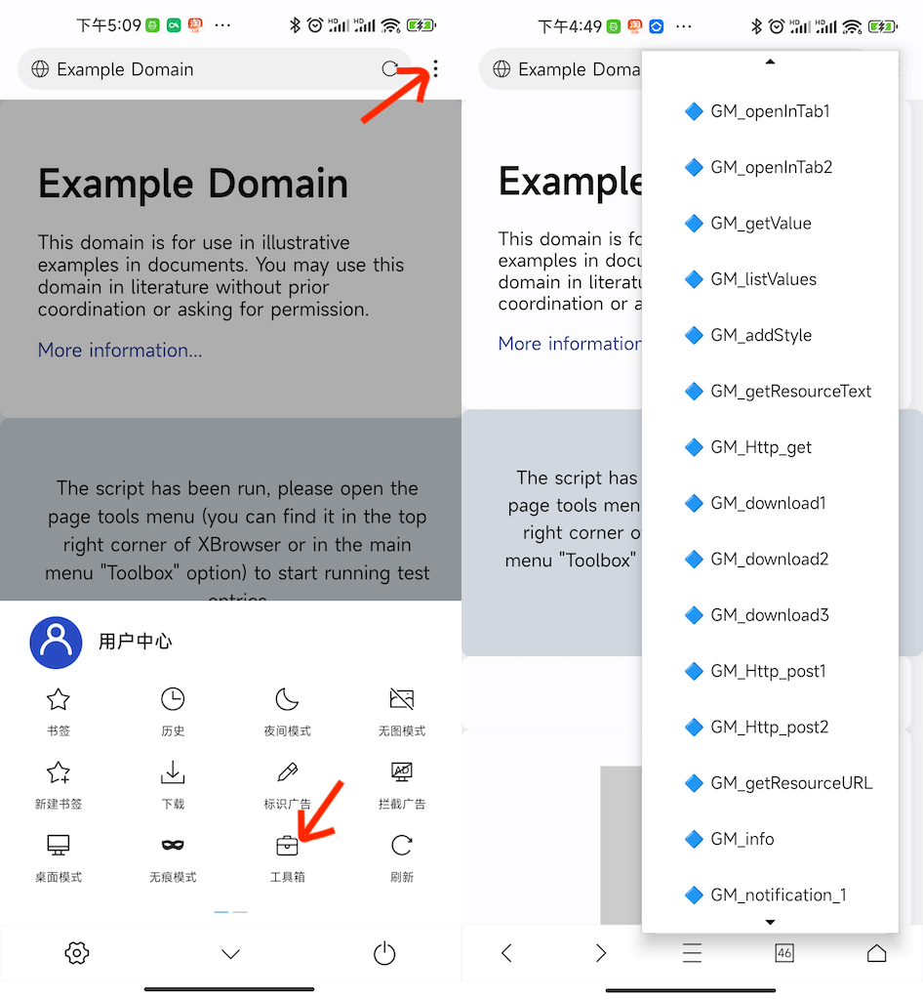
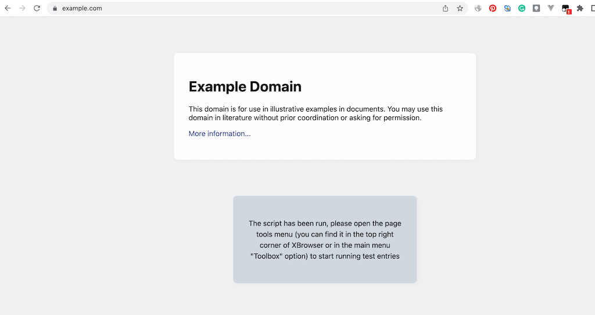
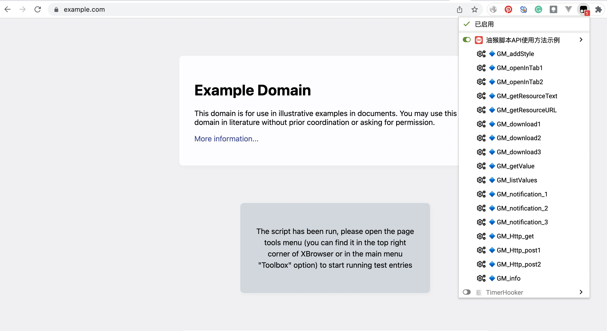

此脚本用来展示 油猴脚本API的使用方法，包含了大部分GM函数使用方法代码示例。我们可以通过运行这些例子来了解这些API的使用方法和特性。下面分别介绍如何在[X浏览器](https://www.xbext.com)和Chrome中运行测试脚本。

## 在X浏览器中运行示例脚本

1. 确认X浏览器版本为3.7.8及以上版本，可以直接在X浏览器中打开脚本源码URL自动安装。

2.  打开 https://www.example.com 页面准备测试。

脚本成功运行后您看到的网页是这样的。

3. 同时X浏览器的页面工具菜单会新增多个选项作为测试每个API函数的入口，如下图所示。

## 在Chrome 中运行示例脚本

1. 我们假定您的Chrome中已经安装了油猴(Tampermonkey)扩展，打开管理面板, 切换到"实用工具标签"。 选择"从URL安装" 。

2. 脚本安装成功后同样打开 https://www.example.com 页面。

脚本运行成功后您看到的网页时这样的

3. 点击油猴扩展您会看到油猴脚本的测试选项。

